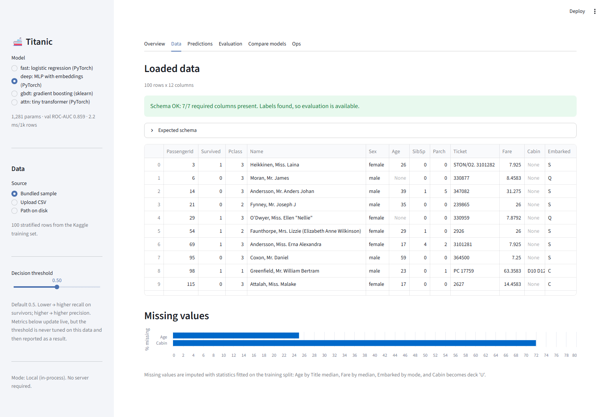
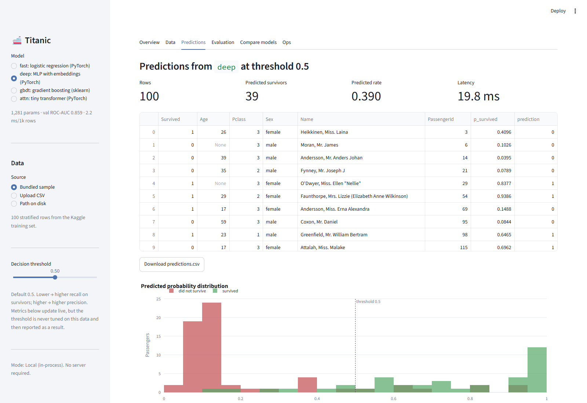
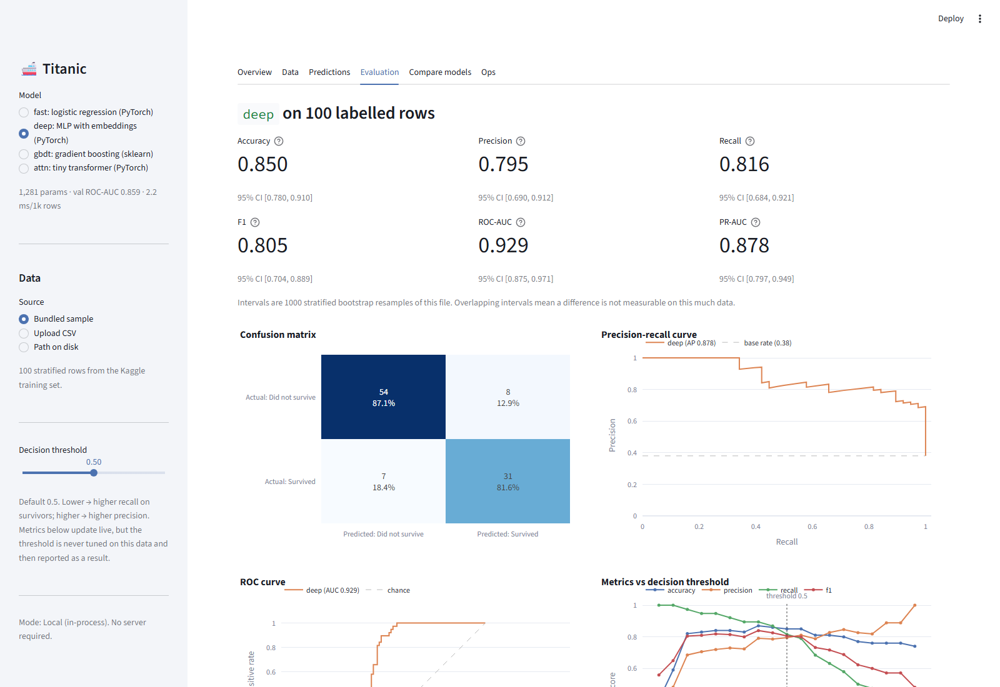

# Titanic Survival: End-to-End Classification Pipeline (PyTorch + Streamlit)

This project fetches the Kaggle Titanic `train.csv` programmatically, explores it, and builds a
leak-safe preprocessing pipeline. On top of that one pipeline it trains four classifiers: a
logistic regression in PyTorch, an MLP with categorical embeddings, a tiny FT-Transformer-style
attention model, and a gradient-boosting reference. The models are evaluated on a held-out split
with bootstrap confidence intervals, compared in a Streamlit app, and served through an
instrumented inference API (FastAPI with per-stage latency, usage, error rate, queue depth, a
drift signal, Prometheus `/metrics` and an Ops dashboard in the app).


The main finding is a negative one. On 179 held-out passengers, a 34-parameter logistic
regression matches a 7,361-parameter transformer. Every model's 95% confidence interval overlaps
every other's, so the models cannot be told apart statistically on this data. The comparison
itself is the result we care about; there is no winner to announce.

---

## Contents

1. [Quick start](#quick-start)
2. [Kaggle setup](#kaggle-setup)
3. [Repository structure](#repository-structure)
4. [Architecture](#architecture)
5. [Methodology](#methodology)
6. [Results](#results)
7. [Streamlit app](#streamlit-app)
8. [Inference API & observability](#inference-api--observability)
9. [Testing](#testing)
10. [Design decisions](#design-decisions)
11. [Assumptions & limitations](#assumptions--limitations)
12. [Future work](#future-work)

---

## Quick start

Requires Python 3.11+ (developed on 3.14; 3.11 and 3.12 also work). Trained artifacts are
committed, so the app runs right after install without Kaggle credentials.

**Windows (PowerShell)**

```powershell
git clone <repo-url>
cd hw1_titanic
py -3.14 -m venv .venv                 # any of 3.11 / 3.12 / 3.13 / 3.14
.\.venv\Scripts\Activate.ps1           # if blocked: Set-ExecutionPolicy -Scope CurrentUser RemoteSigned
python -m pip install --upgrade pip
pip install -r requirements.txt
pip install -e .

streamlit run ds_app.py                # 1. app works right away on the committed artifacts

python -m titanic.data --fetch         # 2. Kaggle -> data\train.csv  (see Kaggle setup)
python train.py --model all            # 3. retrain everything -> artifacts\  (~80 s on CPU)

uvicorn api.main:app --port 8000       # 4. (optional) API + /docs + /metrics + /stats
$env:TITANIC_API_URL="http://127.0.0.1:8000"; streamlit run ds_app.py   # app in API mode
```

**macOS / Linux**

```bash
git clone <repo-url> && cd hw1_titanic
python3.12 -m venv .venv && source .venv/bin/activate
pip install -r requirements.txt && pip install -e .
streamlit run ds_app.py
python -m titanic.data --fetch && python train.py --model all
```

Without Kaggle credentials, train on the committed 100-row sample instead:

```powershell
python train.py --model all --data-path data\sample_train.csv --no-cv
```

That is a smoke run with 80 training rows, so don't read anything into its numbers.

> **Note on dependency pins.** `pandas`, `scipy` and `scikit-learn` are pinned below their
> latest releases on purpose. Windows Smart App Control blocks freshly published, low-reputation
> native `.pyd` files *at import time*. `pandas 3.0.6`, `scipy 1.18.1` and `scikit-learn 1.9.1`
> all installed successfully and then failed with
> `DLL load failed ... An Application Control policy has blocked this file`. The pinned versions
> load cleanly. See [`docs/DECISIONS.md`](docs/DECISIONS.md).

## Kaggle setup

You only need this to retrain. The app and the committed artifacts work without it.

1. Create an API token at <https://www.kaggle.com/settings> → *Create New Token*. Kaggle issues
   either a classic `kaggle.json` or a newer `KGAT_`-prefixed access token. Both work:

   | credential | where to put it |
   |---|---|
   | `kaggle.json` | `%USERPROFILE%\.kaggle\kaggle.json` (Windows) / `~/.kaggle/kaggle.json` (`chmod 600`) |
   | `KGAT_...` token | `~/.kaggle/access_token`, or the `KAGGLE_API_TOKEN` environment variable |
   | classic pair | `KAGGLE_USERNAME` + `KAGGLE_KEY` environment variables |

2. Accept the competition rules once at
   <https://www.kaggle.com/competitions/titanic/rules>. The API returns 403 otherwise.
3. `python -m titanic.data --fetch` downloads only `train.csv` to `data/train.csv`
   (git-ignored). `test.csv` and `gender_submission.csv` are never downloaded or read.

Without credentials the command prints the setup steps and exits cleanly instead of showing a
stack trace.

## Repository structure

```
.
├── train.py                  # training CLI: load -> split -> fit -> train -> evaluate -> save
├── ds_app.py                 # Streamlit entry point (169 lines; all UI logic lives in app/)
├── requirements.txt          # pinned; torch CPU index on line 1
├── data/
│   └── sample_train.csv      # 100 stratified rows, committed (demo + smoke tests)
├── notebooks/
│   ├── eda.ipynb             # the DATA: 11 sections, 7 figures, executed with outputs
│   ├── results.ipynb         # the RESULTS: 23 figures, re-scored from the artifacts
│   ├── build_eda.py          # generates eda.ipynb (a .ipynb diff is unreviewable)
│   └── build_results.py      # generates results.ipynb
├── src/titanic/
│   ├── config.py             # Paths, SplitConfig, TrainConfig, schema constants
│   ├── data.py               # Kaggle fetch, load_csv, validate_schema, stratified_split
│   ├── features.py           # pure, row-independent feature engineering
│   ├── preprocessing.py      # Preprocessor: fit / transform / save / load (JSON)
│   ├── models.py             # TitanicLinear, TitanicMLP, TitanicAttention, build_model
│   ├── sklearn_models.py     # HistGradientBoosting on the same arrays
│   ├── training.py           # training loop, EarlyStopping, leak-free cross_validate
│   ├── evaluation.py         # metrics, bootstrap CIs, curve data (no plotting)
│   ├── plots.py              # nine shared Plotly figures
│   ├── artifacts.py          # Bundle, save/load, registry
│   ├── schemas.py            # Pydantic models shared by API and app
│   ├── metrics.py            # MetricsRegistry: Prometheus + exact-percentile ring buffer
│   ├── service.py            # InferenceService: THE single inference path
│   └── utils.py              # set_seed, get_logger, timer
├── api/
│   ├── settings.py           # TITANIC_* environment configuration
│   └── main.py               # FastAPI adapter (routes map exceptions to status codes)
├── app/
│   ├── client.py             # Predictor protocol: LocalPredictor | ApiPredictor
│   ├── state.py              # cached loaders
│   ├── components.py         # reusable widgets
│   └── tabs.py               # one function per tab
├── scripts/load_test.py      # async load generator; reports p50/p95/p99 and peak queue depth
├── artifacts/                # committed, 485 KB: registry.json + one directory per model
├── tests/                    # 198 tests
└── docs/                     # ARCHITECTURE, API, DECISIONS, CODE_WALKTHROUGH, screenshots
```

## Architecture

```
Kaggle train.csv ─► data.load_csv ─► validate_schema ─► stratified_split (80/20, seed 42)
                                                              │
                        ┌─────────────────────────────────────┴──────────────┐
                   train_df (712)                                      val_df (179)
                        │                                                    │
             features.engineer (pure)                             features.engineer
                        │                                                    │
        Preprocessor.fit(train ONLY) ──► preprocessor.json                   │
                        │                                                    │
   5-fold CV inside the training split ─► pick config ─► train               │
                        │                                                    │
        model.pt / model.joblib + model_config.json + history.json           │
                        │                                                    │
                        └──────────► evaluation.compute_metrics ◄────────────┘  (scored ONCE)
                                              │
                              metrics.json + plots/*.html + registry.json
```

At inference time the app and the API both call the same object:

```
InferenceService.predict(df, model, threshold)
    └─ queue (bounded semaphore) ─► features.engineer ─► preprocessor.transform
       ─► bundle.predict_proba ─► threshold        [every stage timed, every call recorded]
```

Nothing in `app/` or `api/` touches a model directly. Because the metrics belong to the service
and not to the web framework, the Ops tab shows real latency and queue numbers in local mode
with no server running.

### `train.py` options

```
--model {fast,deep,gbdt,attn,all}   which model(s) to train        (default: all)
--data-path PATH        CSV to use instead of data/train.csv
--artifacts-dir PATH    output directory                          (default: artifacts/)
--seed INT              global seed                                (default: 42)
--test-size FLOAT       validation fraction                        (default: 0.2)
--epochs INT            override max epochs
--threshold FLOAT       decision threshold                         (default: 0.5)
--cv-folds INT          cross-validation folds                     (default: 5)
--n-boot INT            bootstrap resamples, 0 to skip             (default: 1000)
--cv / --no-cv          run the hyperparameter grids               (default: on)
```

## Methodology

**Split.** Stratified 80/20 from `train.csv`, seed 42 → 712 train / 179 validation. The
validation split is scored exactly once, at the end of training. Every selection decision uses
5-fold stratified cross-validation inside the training split.

**EDA.** [`notebooks/eda.ipynb`](notebooks/eda.ipynb) splits before exploring and deletes the
validation frame, so the held-out rows never influence a modelling decision. That kind of
analyst-level leakage is something no code-level guard would catch. The notebook has eleven
sections, each written as Question → Finding → Decision.

**Features.** `Pclass`, `Sex`, `Embarked`, `Title` (from `Name`), `Deck` (from `Cabin`; missing
→ `U`), `IsAlone`, `Age` (imputed by Title median), `log1p(Fare)`, `FamilySize`.

Batch-dependent features (ticket-group size, fare-per-person) were left out on purpose. The
notebook shows why in two lines of output:

```
TicketGroupSize computed on a single-row request: 1
The same passenger's true value in the training batch: 6
```

The same passenger gets a different feature value depending on who else is in the file. That is
train/serve skew, and within training it also leaks labels across rows.

**Preprocessing.** A `Preprocessor` is fitted on the training split only. Every learned value
(Title→Age median table, Fare median, Embarked mode, scaling statistics, category vocabularies
with an `<UNK>` index at 0) is serialised to `preprocessor.json` and reused unchanged at
validation and inference. The fitted value `Master → 3.0`, against a global median of `28.5`, is
most of the case for title-based imputation.

**Models.** All four consume the same `(X_num, X_cat)` arrays and follow the same artifact
contract.

| name | framework | architecture | params | selection |
|---|---|---|---|---|
| `fast` | PyTorch | logistic regression (one-hot + numerics → `Linear(→1)`) | 34 | none (one obvious config) |
| `deep` | PyTorch | embeddings + MLP, ReLU, dropout, weight decay | 1,281 | 8-config grid, 5-fold CV |
| `gbdt` | scikit-learn | HistGradientBoosting with a categorical mask | 1,084 nodes | 4-config grid, 5-fold CV |
| `attn` | PyTorch | feature tokens + `[CLS]` → 2 transformer layers (d=16) | 7,361 | single config (time-boxed) |

`fast` is logistic regression implemented in PyTorch on purpose. It uses the same loop, loss,
optimiser, batching and seed as the MLP, so a gap between the two can be put down to the
architecture rather than a different training recipe.

PyTorch models use `BCEWithLogitsLoss`, `AdamW`, batch 64, and early stopping on a 10%
stratified carve-out of the training split. The held-out set is never used for early stopping.

**Evaluation.** Accuracy, precision, recall, F1, ROC-AUC, PR-AUC, Brier and a confusion matrix
at threshold 0.5, each with a 95% stratified bootstrap CI (1000 resamples).

## Results

Held-out validation, n = 179, threshold 0.5, 95% bootstrap CI in brackets:

| model | params | accuracy | precision | recall | F1 | ROC-AUC | PR-AUC |
|---|---|---|---|---|---|---|---|
| `fast` | 34 | 0.827 [0.777, 0.883] | 0.797 [0.716, 0.875] | 0.739 [0.638, 0.841] | 0.767 [0.691, 0.843] | **0.859** [0.796, 0.919] | 0.828 [0.751, 0.904] |
| `deep` | 1,281 | 0.821 [0.771, 0.872] | 0.825 [0.737, 0.906] | 0.681 [0.580, 0.797] | 0.746 [0.661, 0.825] | **0.859** [0.795, 0.918] | 0.828 [0.747, 0.905] |
| `gbdt` | 1,084 | **0.832** [0.777, 0.883] | 0.810 [0.730, 0.893] | 0.739 [0.638, 0.841] | **0.773** [0.692, 0.844] | 0.848 [0.781, 0.911] | **0.830** [0.761, 0.898] |
| `attn` | 7,361 | 0.788 [0.732, 0.844] | 0.792 [0.694, 0.889] | 0.609 [0.493, 0.725] | 0.689 [0.589, 0.775] | 0.840 [0.776, 0.905] | 0.824 [0.754, 0.891] |

Brier scores (calibration): `fast` 0.136, `deep` 0.137, `gbdt` 0.137, `attn` 0.144.
Inference: 1.9 to 17.1 ms per 1000 rows.

**Which would I ship, and why?**

`deep` and `fast` tie at 0.859 ROC-AUC, `gbdt` has the best accuracy and F1, and `attn` is last
on every metric. However, every model's point estimate falls inside every other model's 95%
interval, so none of these orderings means much at n = 179. The intervals are roughly ±0.06 wide,
far wider than the 0.019 spread between the best and worst model.

I would ship `fast`. It is a 34-parameter logistic regression that matches the best measured
ROC-AUC, trains in under two seconds, runs in 1.9 ms per 1000 rows, and has coefficients you can
read directly. Choosing the 7,361-parameter transformer would mean paying 200× the parameters and
8× the latency for a difference the data cannot resolve.

This is what we expected, and the EDA predicted it: 712 training rows, 9 features, and a signal
dominated by a few low-order effects (sex, then class, then age). The notebook's classical
cross-validation set the expectation band (ROC-AUC 0.86 to 0.89) before any PyTorch code was
written. It also showed that the fold-to-fold spread (0.080) is larger than the gap between any
two models. The neural networks were unlikely to win, and showing that clearly, with intervals,
is more useful than a tuned number.


Every figure behind these numbers is in [`notebooks/results.ipynb`](notebooks/results.ipynb),
alongside the code that produced it: ROC and PR curves for all four models, confusion matrices,
threshold sweeps, calibration, probability distributions, training curves and the cost
comparison. That notebook loads the saved bundles, recreates the held-out split and re-scores
every model from scratch, then asserts that the metrics it computes match
`artifacts/*/metrics.json` to 10 decimal places. If the pipeline had drifted, it would fail
rather than mislead.

Reproduce with `python train.py --model all` (~80 s on CPU). The same machine and torch version
give identical numbers; across platforms, expect agreement to about 3 decimals.

## Streamlit app

```powershell
streamlit run ds_app.py        # local mode: loads artifacts from disk, no server needed
```

The app has six tabs: Overview, Data, Predictions, Evaluation, Compare models and Ops.

| | |
|---|---|
|  |  |
| **Data**: preview, missingness, schema validation with actionable errors | **Predictions**: probability and class per row, downloadable CSV |
|  |  |
| **Evaluation**: metrics with CIs, confusion matrix, ROC, PR, threshold sweep, calibration | **Ops**: latency per stage, queue depth, error rate, drift |

- **Sidebar:** model selector (only models that exist), data source (bundled sample / upload /
  path on disk), decision-threshold slider, and a mode badge showing Local or API.
- **Evaluation** appears only when the CSV has a `Survived` column. Without it, the app still
  runs inference and explains that metrics need labels; it does not crash.
- **Compare models** generates its verdict paragraph from the numbers, so the text stays in step
  with the results after a retrain.
- An exception inside a tab is shown as a readable message, with the traceback tucked into an
  expander instead of a raw red traceback.

Expected input: the raw Kaggle Titanic schema (`Pclass, Name, Sex, Age, SibSp, Parch, Fare`
required; `PassengerId, Cabin, Embarked, Ticket, Survived` optional).

## Inference API & observability

```powershell
uvicorn api.main:app --port 8000        # Swagger UI at http://127.0.0.1:8000/docs

Invoke-RestMethod -Method Post -Uri http://127.0.0.1:8000/predict -ContentType application/json `
  -Body '{"model":"deep","passengers":[{"Pclass":3,"Name":"Braund, Mr. Owen Harris","Sex":"male","Age":22,"SibSp":1,"Parch":0,"Fare":7.25}]}'
```

```bash
curl -s -X POST http://127.0.0.1:8000/predict -H 'content-type: application/json' \
  -d '{"model":"deep","passengers":[{"Pclass":3,"Name":"Braund, Mr. Owen Harris","Sex":"male","Age":22,"SibSp":1,"Parch":0,"Fare":7.25}]}'
```

| endpoint | what |
|---|---|
| `POST /predict` | JSON rows → probabilities, classes, per-stage latency |
| `POST /predict/csv` | CSV upload → predictions as JSON or CSV (via `Accept`) |
| `POST /evaluate` | labelled CSV → metrics with bootstrap CIs, confusion matrix, curves |
| `GET /models`, `/health`, `/schema` | registry, liveness, expected columns |
| `GET /stats` | JSON: requests and rows per model, p50/p95/p99 per stage, queue depth, error rate, drift |
| `GET /metrics` | Prometheus exposition (`titanic_*` plus process metrics) |
| `POST /admin/reload` | reload artifacts; disabled unless `TITANIC_ADMIN_TOKEN` is set |

All errors use one shape, `{"error", "message", "details"}`. Tracebacks are not returned to the
client; they are logged on the server against the `X-Request-ID` that is echoed in the response.

**Back-pressure.** Concurrency is bounded (`TITANIC_MAX_CONCURRENCY=2`, `TITANIC_MAX_QUEUE=64`,
`TITANIC_QUEUE_TIMEOUT_S=5`). Excess load gets `503` + `Retry-After: 1` rather than unbounded
latency. Queue depth counts requests that are *waiting*, not the ones executing. In-flight count
hits `max_concurrency` as soon as the service is busy and then stops telling you anything, which
is why autoscalers watch depth instead.

```
$ python scripts/load_test.py --n 300 --concurrency 16 --model deep

load_test: n=300 concurrency=16 model=deep rows/req=1
  p50=109.81 ms  p95=221.5 ms  p99=259.07 ms  max=367.54 ms
  ok=300  rejected(503)=0  failed=0  rps=136.9
  peak_queue_depth=13  peak_inflight=2  (32 stats samples over 2.19s)
  server p95 by stage: queue=154.267ms  preprocess=9.891ms  inference=16.608ms  postprocess=0.056ms
```

The last line is why per-stage timing is worth having. Under load, queue p95 is 154 ms while the
model itself takes 16.6 ms. Almost all of the latency is waiting rather than computing, so the
fix would be more capacity, not a faster model. In-flight correctly stays at 2 while depth climbs
to 13.

Full specification: [`docs/API.md`](docs/API.md).

### Streamlit ↔ API modes

| mode | how | inference path | Ops data |
|---|---|---|---|
| local (default) | `streamlit run ds_app.py` | in-process `InferenceService` | `service.stats()` |
| api | `TITANIC_API_URL=http://127.0.0.1:8000 streamlit run ds_app.py` | `httpx` → `/predict/csv`, `/evaluate` | `GET /stats` |

If the API is unreachable, the app falls back to local mode and shows a warning. The API is an
optional extra layer; the app does not depend on it.

## Testing

```powershell
pytest -q                    # 198 tests
ruff check . ; black --check .
```

| file | what it guards |
|---|---|
| `test_data.py` | schema validation, split determinism, train/val disjointness |
| `test_features.py` | purity, single-row independence, no batch-dependent features |
| `test_preprocessing.py` | **leakage** (fitted state unchanged after transforming validation), JSON round-trip, `<UNK>` handling |
| `test_models.py` | forward contract, gradients reach every parameter, eval-mode determinism |
| `test_evaluation.py` | hand-computed metrics, interval ordering, curve alignment |
| `test_train_smoke.py` | the real CLI end to end, artifact contract, partial registries |
| `test_service.py` | **queue depth with a blocked slot**, back-pressure, slot release on failure |
| `test_api.py` | status codes, single error shape, no traceback to the client |
| `test_notebook.py` | notebook has not drifted from `src/`, has no stored tracebacks |

The most important one is the leakage test:

```python
before = json.dumps(fitted.to_dict(), sort_keys=True)
fitted.transform(val_df)                      # transform the validation split
after  = json.dumps(fitted.to_dict(), sort_keys=True)
assert before == after                        # nothing was learned from it
```

It compares the whole serialised state, so a parameter added later is covered automatically.

## Design decisions

The full log, written as interviewer Q&A, is in [`docs/DECISIONS.md`](docs/DECISIONS.md).
[`docs/CODE_WALKTHROUGH.md`](docs/CODE_WALKTHROUGH.md) explains every module line by line.

In short:

- four models on one preprocessor and one artifact contract
- JSON artifacts (joblib only for `gbdt`, which has no clean JSON form)
- batch-dependent features excluded
- selection by CV inside the training split only
- bootstrap CIs on every metric
- metrics owned by the service rather than the web layer

## Assumptions & limitations

- A single 80/20 split means validation estimates carry roughly ±0.06 uncertainty. The reported
  intervals reflect that, and it is why no model is declared a winner.
- Model selection on 712 rows: the grids are kept small (8 configs for `deep`, 4 for `gbdt`)
  because the CV standard deviation (~0.02) exceeds most between-config differences.
- No nested CV, and no hyperparameter search for `fast` or `attn`.
- `attn` shows that the modern tabular-DL architecture can be implemented correctly at a small
  size. On 712 rows it was not expected to win, and it did not.
- Metrics are per-process; run `uvicorn --workers 1`. No auth or per-client rate limiting.
- Determinism holds per machine and torch version, not bit-exactly across platforms.
- The app expects the Kaggle column names; there is no fuzzy column matching.

## Future work

- Nested CV or repeated splits for tighter selection estimates.
- Probability calibration (temperature scaling) if the probabilities were consumed downstream.
- SHAP or permutation importance in the app.
- CI workflow running `pytest` and a smoke `train.py`.
- Dockerfile and a hosted deployment (delivery is local-only by design).
- Multi-process metrics (`prometheus_client.multiprocess`), OpenTelemetry tracing, feature-level
  drift (PSI) on top of the positive-rate signal, request batching across clients.
- Batch-safe group features via a fitted ticket lookup, if the deployment context justified it.
