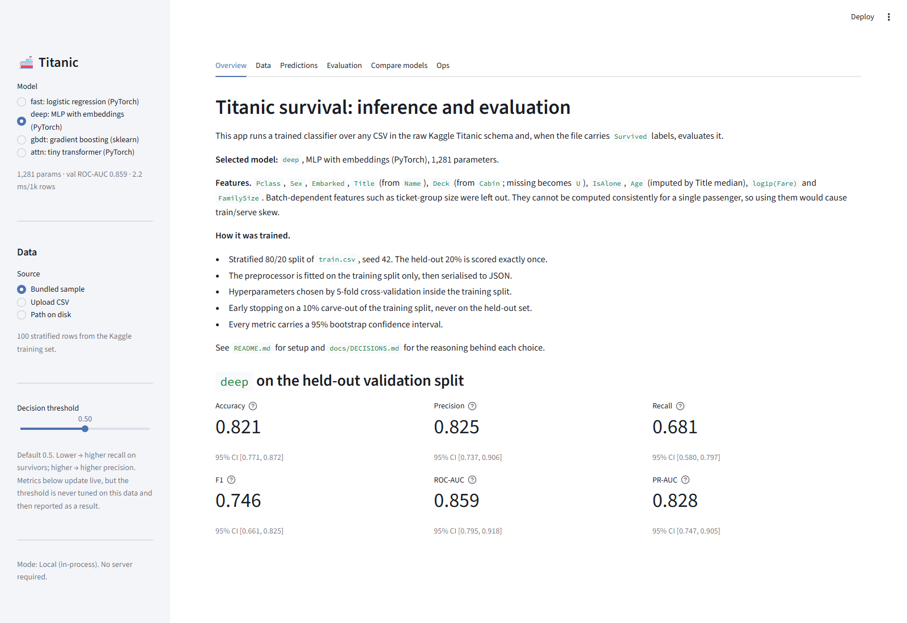
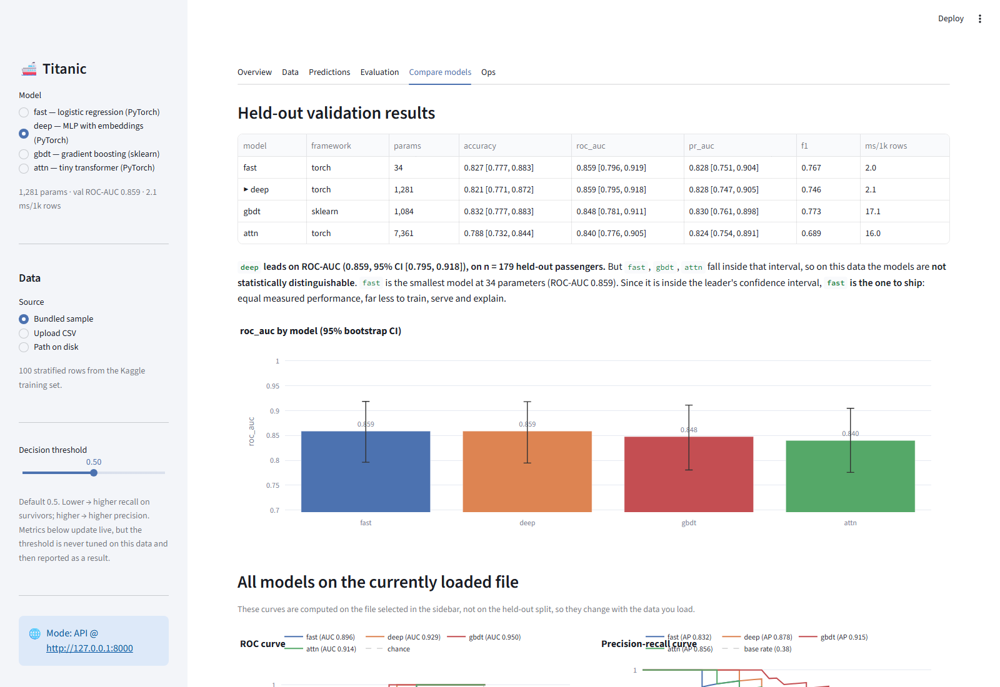
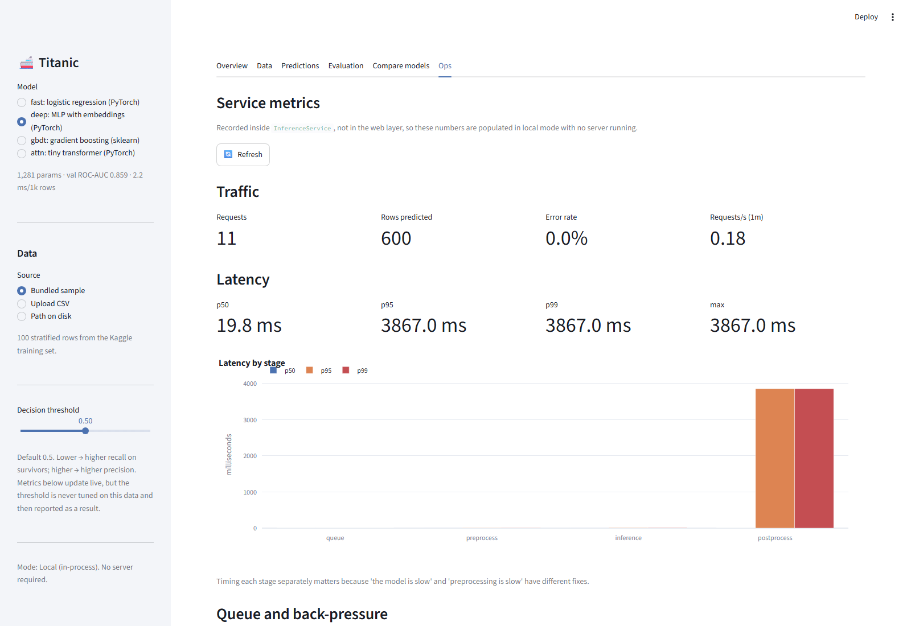

# Titanic Survival — End-to-End Classification Pipeline (PyTorch + Streamlit)

<!-- TODO(phase 6): badges (python 3.12, tests passing) -->

An interview take-home: fetch the Kaggle Titanic `train.csv`, explore it, build a leak-safe
preprocessing pipeline, train a **ladder of classifiers on one shared pipeline** — logistic
regression in PyTorch, an MLP with categorical embeddings, a tiny attention (FT-Transformer-style)
model, and a gradient-boosting reference — with a reproducible `train.py`, evaluate on a held-out
validation split with bootstrap confidence intervals, compare them in a Streamlit app, and serve
them through an **instrumented inference API** (FastAPI; latency per stage, usage, error rate,
queue depth, drift signal — Prometheus `/metrics` + an Ops dashboard in the app).

<!-- TODO(phase 6): hero screenshot -->


---

## Contents

1. [Quick start](#quick-start)
2. [Kaggle setup](#kaggle-setup)
3. [Repository structure](#repository-structure)
4. [Architecture](#architecture)
5. [Methodology](#methodology)
6. [Results](#results)
7. [Streamlit app](#streamlit-app)
8. [Inference API & observability](#inference-api--observability)
9. [Design decisions](#design-decisions)
10. [Assumptions & limitations](#assumptions--limitations)
11. [Future work](#future-work)

---

## Quick start

Requires **Python 3.12** (3.11 also works). Trained artifacts are committed, so the app runs
immediately; training needs Kaggle credentials (or the bundled sample).

**Windows (PowerShell)**

```powershell
git clone <repo-url>
cd <repo>
py -3.12 -m venv .venv
.\.venv\Scripts\Activate.ps1        # if blocked: Set-ExecutionPolicy -Scope CurrentUser RemoteSigned
python -m pip install --upgrade pip
pip install -r requirements.txt
pip install -e .

streamlit run ds_app.py               # 0. app works right away on committed artifacts (no server)

python -m titanic.data --fetch        # 1. Kaggle → data\train.csv   (see Kaggle setup)
python train.py --model all           # 2. retrain all models → artifacts\

uvicorn api.main:app --port 8000      # 3. (optional) inference API, /docs, /metrics, /stats
$env:TITANIC_API_URL="http://127.0.0.1:8000"; streamlit run ds_app.py   # app in API mode
```

**macOS / Linux**

```bash
git clone <repo-url> && cd <repo>
python3.12 -m venv .venv && source .venv/bin/activate
pip install -r requirements.txt && pip install -e .
streamlit run ds_app.py
python -m titanic.data --fetch && python train.py --model all
```

Without Kaggle credentials: `python train.py --model all --data-path data/sample_train.csv`
(smoke run on 100 rows — not real results).

Tested on Windows 11 / Python 3.12 <!-- TODO: add anything else you verified -->.

## Kaggle setup

1. Create an API token at https://www.kaggle.com/settings → "Create New Token"; save
   `kaggle.json` to `%USERPROFILE%\.kaggle\kaggle.json` (Windows) or `~/.kaggle/kaggle.json`
   (`chmod 600`) **or** set `KAGGLE_USERNAME` / `KAGGLE_KEY` environment variables.
2. Accept the competition rules once at https://www.kaggle.com/competitions/titanic/rules
   (the API refuses downloads otherwise).
3. `python -m titanic.data --fetch` downloads **only `train.csv`** to `data/train.csv`
   (git-ignored). `test.csv` and `gender_submission.csv` are never downloaded or used.

## Repository structure

```
<!-- TODO(phase 6): paste `tree -I ".venv|__pycache__"` output -->
```

## Architecture

<!-- TODO(phase 6): copy the data-flow diagram from docs/ARCHITECTURE.md §1 -->

- `src/titanic/` — library code (data, features, preprocessing, models, training, evaluation, artifacts).
- `train.py` — CLI that runs the full pipeline and writes `artifacts/<model>/`.
- `src/titanic/service.py` + `metrics.py` — `InferenceService`: the single inference path with a
  bounded concurrency queue and Prometheus metrics; used in-process by Streamlit and by the API.
- `api/` — FastAPI adapter: `/predict`, `/predict/csv`, `/evaluate`, `/models`, `/health`,
  `/stats`, `/metrics`.
- `ds_app.py` + `app/` — Streamlit inference/evaluation UI (Plotly); local mode needs no server.
- `notebooks/eda.ipynb` — exploratory analysis; imports feature logic from `src/` (no duplication).
- `artifacts/` — committed; `registry.json` + per-model `model.pt` (or `model.joblib` for
  `gbdt`), `model_config.json`, `preprocessor.json`, `metrics.json`, `history.json`, `plots/*.html`.

### `train.py` options

```
--model {fast,deep,attn,gbdt,all}   which model(s) to train  (default: all)
--data-path PATH          CSV to use instead of Kaggle fetch (default: data/train.csv)
--seed INT                global seed                         (default: 42)
--test-size FLOAT         validation fraction                 (default: 0.2)
--epochs INT              max epochs override
--cv / --no-cv            run the small CV grids (deep, gbdt) (default: on)
--artifacts-dir PATH                                          (default: artifacts/)
```

## Methodology

**Split.** Stratified 80/20 from `train.csv` (seed 42). The 20% is scored exactly once.

**Features.** `Pclass`, `Sex`, `Embarked`, `Title` (from `Name`), `Deck` (from `Cabin`, missing
→ `U`), `IsAlone`, `Age` (imputed by Title median), `log1p(Fare)`, `FamilySize`. Batch-dependent
features (ticket-group size, fare per person) were deliberately excluded because they cannot be
computed consistently for a single inference row — see `docs/DECISIONS.md`.

**Preprocessing.** A `Preprocessor` fitted on the training split only; all learned values
(imputation tables, scaling stats, vocabularies with an `<UNK>` index) are serialized to
`preprocessor.json` and reused unchanged at validation and inference time.

**Models** (all consume the same preprocessed features; all selectable in the app).
| name | framework | architecture | params | selection |
|------|-----------|--------------|--------|-----------|
| `fast` | PyTorch | logistic regression (one-hot + numerics → linear) | <!-- TODO --> | none |
| `deep` | PyTorch | embeddings + MLP 64→32, ReLU, dropout, weight decay | <!-- TODO --> | 8-config grid, 5-fold stratified CV on the training split |
| `attn` | PyTorch | feature tokens + [CLS] → 2 transformer encoder layers (d=16) | <!-- TODO --> | single config (time-boxed) |
| `gbdt` | sklearn | HistGradientBoosting with categorical mask | <!-- TODO --> | 4-config grid, 5-fold CV |

PyTorch models use `BCEWithLogitsLoss`, `AdamW`, batch 64, early stopping on an inner 10%
carve-out of the training split. The held-out 20% is never used for selection.

**Evaluation.** Accuracy, precision, recall, F1, ROC-AUC, PR-AUC, Brier, confusion matrix at
threshold 0.5, each with a 95% bootstrap CI (1000 resamples on the validation set).

## Results

<!-- TODO(phase 6): fill from artifacts/*/metrics.json -->

Held-out validation (n = 179), threshold 0.5, 95% bootstrap CI in brackets:

| model  | params | accuracy | precision | recall | F1 | ROC-AUC | PR-AUC |
|--------|--------|----------|-----------|--------|----|---------|--------|
| `fast` | | 0.xx [0.xx, 0.xx] | | | | | |
| `deep` | | 0.xx [0.xx, 0.xx] | | | | | |
| `attn` | | 0.xx [0.xx, 0.xx] | | | | | |
| `gbdt` | | 0.xx [0.xx, 0.xx] | | | | | |

<!-- TODO: 3–4 honest sentences: are the models distinguishable given the CIs? which would you
     ship and why (usually: the simplest one inside the best model's CI)? -->

<!-- TODO: screenshot of the Compare tab (overlaid ROC) -->


Reproduce: `python train.py --model all` (same machine/torch version → identical numbers;
across platforms expect agreement to ~3 decimals).

## Streamlit app

<!-- TODO(phase 6): 3–4 screenshots: data validation, predictions, evaluation, compare -->

- **Sidebar:** choose model (`fast` / `deep` / `attn` / `gbdt`), data source (bundled sample /
  upload / path), decision threshold (default 0.5).
- **Data:** preview, missingness, schema validation with actionable errors.
- **Predictions:** probability + class per row, downloadable CSV.
- **Evaluation:** metrics with CIs, confusion matrix, ROC, PR, threshold sweep — shown when the
  CSV contains `Survived`; otherwise the app runs inference and explains that metrics need labels.
- **Compare models:** side-by-side metrics with CIs, overlaid ROC/PR curves, training curves,
  parameter counts and inference time for every trained model.

Expected input: the raw Kaggle Titanic schema (`Pclass, Name, Sex, Age, SibSp, Parch, Fare`
required; `Cabin, Embarked, Ticket, PassengerId, Survived` optional).

## Inference API & observability

```powershell
uvicorn api.main:app --port 8000           # Swagger UI at http://127.0.0.1:8000/docs
Invoke-RestMethod -Method Post -Uri http://127.0.0.1:8000/predict -ContentType application/json `
  -Body '{"model":"deep","passengers":[{"Pclass":3,"Name":"Braund, Mr. Owen","Sex":"male","Age":22,"SibSp":1,"Parch":0,"Fare":7.25}]}'
python scripts\load_test.py --n 300 --concurrency 16 --model deep
```

| endpoint          | what                                                                 |
|-------------------|----------------------------------------------------------------------|
| `POST /predict`   | JSON rows → probabilities + classes + per-stage latency               |
| `POST /predict/csv` | CSV upload → predictions CSV/JSON                                   |
| `POST /evaluate`  | labeled CSV → metrics with bootstrap CIs, confusion matrix, curves    |
| `GET /models`, `/health` | registry / liveness                                            |
| `GET /stats`      | JSON: requests & rows per model, p50/p95/p99 per stage, queue depth, in-flight, error rate, drift |
| `GET /metrics`    | Prometheus exposition (`titanic_*` + process metrics)                 |

Concurrency is bounded (`TITANIC_MAX_CONCURRENCY=2`, `TITANIC_MAX_QUEUE=64`,
`TITANIC_QUEUE_TIMEOUT_S=5`); excess load gets `503` + `Retry-After` instead of latency collapse.
**Queue depth** = requests waiting for a slot (the autoscaling signal), distinct from in-flight.

<!-- TODO(phase 6): paste load_test output + Ops tab screenshot -->
```
load_test: n=300 concurrency=16 model=deep rows/req=1
p50=x.x ms  p95=xx.x ms  p99=xx.x ms  errors=0  peak_queue_depth=NN  rps=NNN
```


Full spec: [`docs/API.md`](docs/API.md).

## Design decisions

The full log, in interviewer Q&A format, is in [`docs/DECISIONS.md`](docs/DECISIONS.md).
Headlines: four models on one preprocessor and one artifact contract · JSON artifacts (joblib
only for `gbdt`) · exclusion of batch-dependent features · CV-only model selection · bootstrap CIs.

## Assumptions & limitations

- Single 80/20 split → validation estimates carry ±~0.05 uncertainty; reported CIs reflect it.
- Model selection on one dataset of 712 rows: the CV grid is intentionally tiny.
- No hyperparameter search for `fast` or `attn`; no nested CV.
- `attn` is a demonstration model: on 712 rows it is not expected to beat simpler models.
  <!-- TODO: delete the attn row/mentions if it was not built -->
- Metrics are per-process (`uvicorn --workers 1`); no auth or per-client rate limiting on the API.
- Determinism guaranteed per machine/torch version, not bit-exact across platforms.
- The app expects the Kaggle column names; no fuzzy column matching.

## Future work

- Nested CV / repeated splits for tighter selection estimates.
- Calibration (temperature scaling) if probabilities were to be consumed downstream.
- SHAP / permutation importance in the app.
- CI workflow (GitHub Actions) running `pytest` and a smoke `train.py`.
- Dockerfile / Streamlit Community Cloud deployment (delivery is local-only by design).
- Multi-worker metrics (`prometheus_client.multiprocess`), OpenTelemetry tracing, feature-level
  drift (PSI) on top of the positive-rate signal, request batching across clients.
- Batch-safe group features via a fitted ticket lookup, if the deployment context is known.
